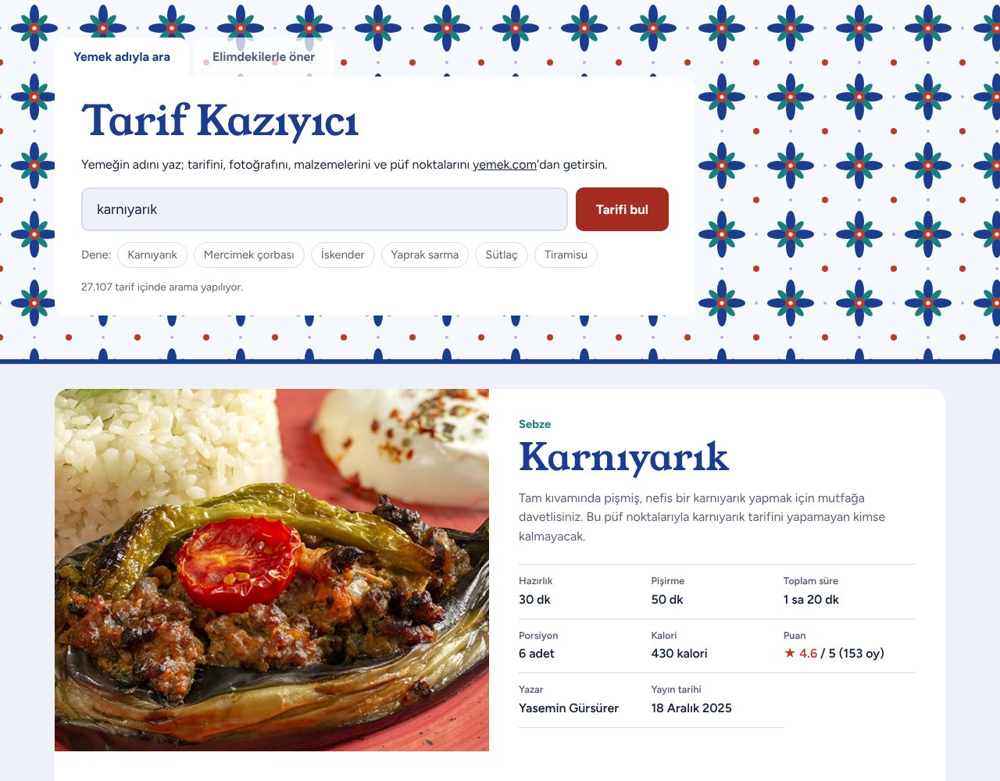
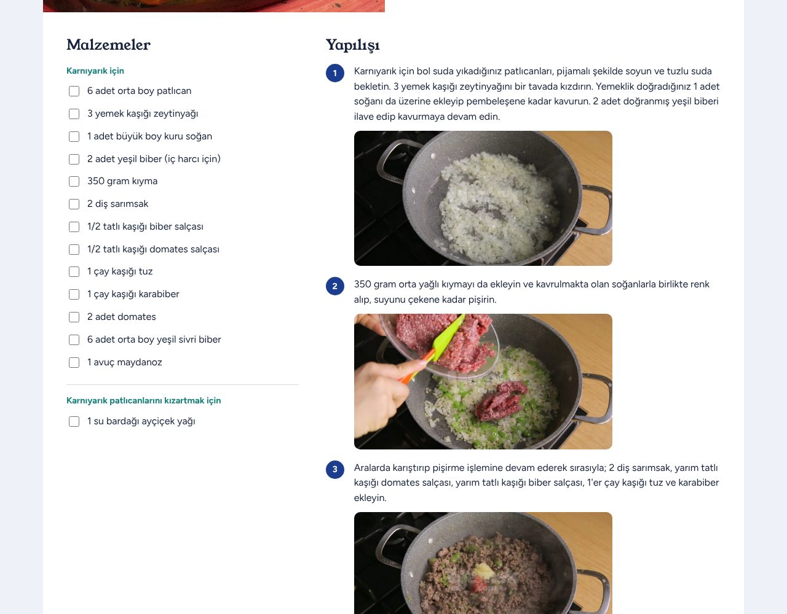
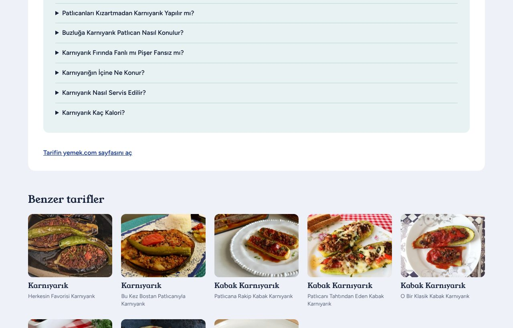
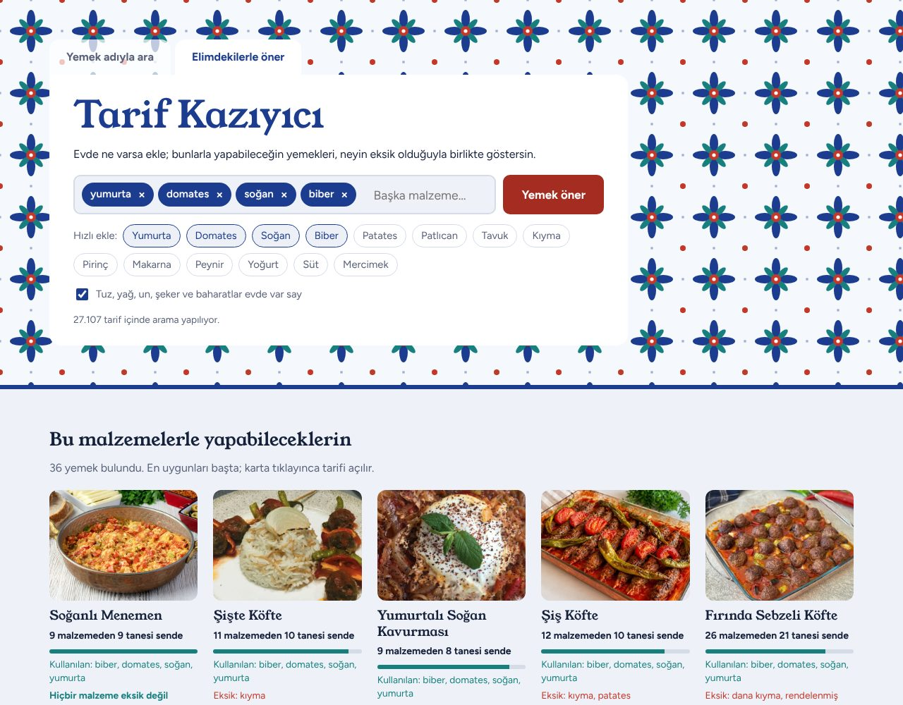
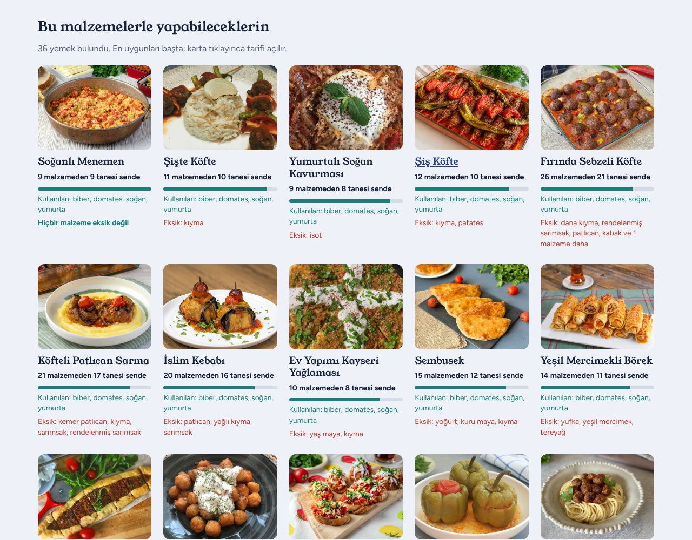

# Tarif Kazıyıcı

Yemeğin adını yazınca tarifini, fotoğrafını, malzemelerini ve püf noktalarını [yemek.com](https://yemek.com/tarif/)'dan **web kazıma (web scraping)** ile getiren bir web sitesi. İkinci sekmesi, evdeki malzemelere göre yemek öneriyor.

Veriler hazır bir API'den değil, **Python `requests` ile indirilen HTML sayfalarının `BeautifulSoup` ile okunmasıyla** elde ediliyor.

**🔗 Canlı site:** <!-- RENDER_LINKI --> _(Render'a yükledikten sonra linki buraya yazın)_

**📂 Kodlar:** bu GitHub sayfası

> Canlı site ücretsiz sunucuda çalıştığı için bir süre kullanılmazsa uykuya geçer; ilk açılışta yaklaşık **1 dakika** bekletebilir, sonrası hızlıdır.



---

## İçindekiler

- [Özellikler](#özellikler)
- [Kurulum ve çalıştırma](#kurulum-ve-çalıştırma)
- [Canlı siteyi yayınlama (Render)](#canlı-siteyi-yayınlama-render)
- [Nasıl çalışıyor?](#nasıl-çalışıyor)
- [Proje yapısı](#proje-yapısı)
- [Ayarlar](#ayarlar)
- [Kazıma kuralları ve etik](#kazıma-kuralları-ve-etik)
- [Sık karşılaşılan sorunlar](#sık-karşılaşılan-sorunlar)
- [Ekran görüntüleri](#ekran-görüntüleri)

---

## Özellikler

### 1. Yemek adıyla arama

- Kutuya yemeğin adını yaz (`karnıyarık`, `mercimek çorbası`, `tiramisu`…). Site yemek.com'daki **27.107 tarif** içinde arar ve en iyi eşleşen tarifi getirir.
- Getirilen bilgiler:
  - yemeğin adı ve büyük fotoğrafı (bilgisayara da indirilir)
  - gruplanmış malzemeler (ör. "Karnıyarık için", "Patlıcanları kızartmak için")
  - adım adım yapılışı ve her adımın fotoğrafı
  - püf noktaları (sık sorulan sorular)
  - kategori, porsiyon, hazırlık / pişirme / toplam süre, kalori, puan, yazar, yayın tarihi
- Türkçe karakter ve yarım yazımda da bulur: `karniyarik` yazınca karnıyarık, `mercim` yazınca mercimek tarifleri, `sarma` yazınca yaprak sarma gelir.
- Benzer isimli diğer tarifler kart olarak listelenir; birine tıklayınca o tarif açılır.
- Bulunan her tarif kaydedilir ve "Daha önce bulduğun tarifler" bölümünde birikir.

### 2. Elimdekilerle öner

- Evdeki malzemeleri etiket olarak ekle (`yumurta`, `domates`, `biber`…).
- Site, malzeme listeleri kazınmış tarifleri tarar ve her yemek için şunları gösterir:
  - kaç malzemenin sende olduğu (ör. "9 malzemeden 8 tanesi sende")
  - senin malzemelerinden hangilerini kullandığı
  - **eksik olanlar**
- "Tuz, yağ, un, şeker ve baharatlar evde var say" seçeneği temel malzemeleri eksik saymaz.
- Bir öneriye tıklayınca tarif açılır, eksik malzemelerin yanında **eksik** etiketi görünür.

---

## Kurulum ve çalıştırma

**Gerekenler:** Python 3.9 veya üzeri ve internet bağlantısı.

```bash
# 1) Gerekli kütüphaneleri kur (requests ve beautifulsoup4)
pip install -r requirements.txt

# 2) Siteyi başlat
python backend.py
```

Tarayıcıda **http://localhost:8000** kendiliğinden açılır. Açılmazsa adresi elle yaz. Kapatmak için terminalde `Ctrl + C`'ye bas.

> `index.html` dosyasına çift tıklayarak açmak **çalışmaz**. Site, verileri `backend.py`'nin başlattığı sunucudan alır; mutlaka `python backend.py` ile açılmalı.

---

## Canlı siteyi yayınlama (Render)

Site, [Render](https://render.com)'ın ücretsiz planında çalışacak şekilde hazırlandı. Ayarlar `render.yaml` dosyasında:

- kurulum: `pip install -r requirements.txt`
- başlatma: `python backend.py`
- sunucu bölgesi: Frankfurt

`backend.py`, Render'ın verdiği `PORT` değişkenini görünce kendiliğinden internet moduna geçer: herkese açık adreste dinler ve tarayıcı açmaya çalışmaz.

Yayınlama adımları:

1. Projeyi GitHub'a yükleyin.
2. [render.com](https://render.com)'da **GitHub ile giriş yapın**.
3. **New → Blueprint** deyip bu depoyu seçin, **Apply**'a basın.
4. Birkaç dakika sonra `https://tarif-kaziyici-xxxx.onrender.com` gibi bir link verilir.

---

## Nasıl çalışıyor?

```
 Tarayıcı (index.html)            backend.py (Python)                    yemek.com
 ─────────────────────            ─────────────────────                  ─────────
  "karnıyarık" yazılır  ──────▶   1. Tarif listesinde arar
                                  2. requests ile sayfayı indirir ─────▶  /tarif/karniyarik/
                                                                 ◀─────  HTML sayfası
                                  3. BeautifulSoup ile HTML'i okur,
                                     etiketlerden bilgileri çıkarır
                                  4. Bir "Tarif" nesnesi oluşturur
  Tarif ekranda görünür  ◀──────  5. Sonucu tarayıcıya gönderir
```

### Web kazıma: `requests` + `BeautifulSoup`

1. **`requests`**, tarif sayfasının HTML kodunu tarayıcının yaptığı gibi indirir.
2. **`BeautifulSoup`**, bu HTML'i bir etiket ağacına çevirir. İstenen bilgiler, sayfadaki etiketlerin CSS sınıflarına göre bulunur.

| Sayfadaki yer (HTML) | Çekilen bilgi | Kullanılan BeautifulSoup kodu |
|---|---|---|
| `<h1 class="recipe-headline-main">` | Yemeğin adı | `select_one("h1.recipe-headline-main").get_text()` |
| `<meta property="og:image">` | Yemeğin fotoğrafı | `find("meta", property="og:image")["content"]` |
| `<meta property="og:description">` | Açıklama | `find("meta", property="og:description")["content"]` |
| `.recipe-ingredients` → `<h3>` + `<ul><li>` | Malzemeler (gruplarıyla) | `select_one(".recipe-ingredients").find_all(["h3", "ul"])` |
| `.recipe-instructions` → `<ol><li>` | Yapılış adımları ve adım fotoğrafları | `select(".recipe-instructions ol > li")`, `img.get("src")` |
| `.recipe-sss` → `<h2>` + `.recipe-seo-body` | Püf noktaları | `select(".recipe-sss .recipe-title-wrapper")` |
| `.content-recipe-small-infos` | Kaç kişilik, hazırlık ve pişirme süresi | `select(".content-recipe-small-infos > div")` |
| `.breadcrumb-list a` | Kategori | `select(".breadcrumb-list a.breadcrumb-link")` |
| `.rating-box` (`data-` özellikleri) | Puan, oy sayısı | `.get("data-initial-average")`, `.get("data-count")` |
| `.recipe-calorie-box` | Kalori | `select_one(".recipe-calorie-box").get_text()` |
| `.editor-box a[href*="/profil/"]` | Yazar | `select_one(".editor-box a[href*='/profil/']")` |

Örnek: malzemelerin HTML'i ve onu okuyan kod. Kodun asıl hali `backend.py` → `TarifKaziyici.tarif_cek` içinde, burada sadeleştirildi:

```html
<div class="recipe-ingredients">
  <h3>Karnıyarık için:</h3>
  <ul>
    <li><span>6 adet</span> orta boy patlıcan</li>
    <li><span>350 gram</span> kıyma</li>
  </ul>
</div>
```

```python
corba = BeautifulSoup(cevap.text, "html.parser")
for etiket in corba.select_one(".recipe-ingredients").find_all(["h3", "ul"]):
    if etiket.name == "h3":
        grup = etiket.get_text().strip().rstrip(":")      # "Karnıyarık için"
    else:
        for li in etiket.find_all("li"):
            malzeme = li.get_text(" ").strip()            # "6 adet orta boy patlıcan"
```

### İsimle arama nasıl yapılıyor?

yemek.com'un kendi arama sayfası (`?q=...`) `robots.txt` dosyasında kazımaya kapalı. Bu yüzden arama için sitenin herkese açık **sitemap** sayfaları kullanılıyor. Sitemap, sitedeki tüm tariflerin adresini, başlığını ve fotoğrafını içeren bir listedir ve yine BeautifulSoup ile okunur (`find_all("url")`, `find("loc")`). Liste `veri/tarif_dizini.json` dosyasına kaydedilir, 7 günde bir kendiliğinden yenilenir.

Yazılan isim bu listede puanlanarak aranır:

- Türkçe karakterler sadeleştirilir; `Karnıyarık` ile `karniyarik` aynı sayılır.
- Adı aranan kelimeyle **biten** tarifler öne alınır. Türkçede yemeğin türü sonda gelir: "yaprak *sarma*" bir sarmadır, "*sarma* baklava" ise bir baklavadır.
- Eşitlik olursa sitede en çok tarifi olan (en sevilen) yemek önce gelir.

### Malzemeyle öneri nasıl yapılıyor?

Sitemap'te malzeme bilgisi yok. Bu yüzden en sevilen ~1.800 yemeğin tarif sayfaları önceden kazınmış, malzeme listeleri `veri/tarif_dizini.json`'a eklenmiştir. Her aramada, adında senin malzemelerin geçen 12 yeni tarifin sayfasına da bakılır. Bakılan tarifler kaydedildiği için site kullandıkça zenginleşir.

Karşılaştırmada:

- Ölçüler atılır: "2 su bardağı sıcak su" → "sıcak su".
- Ekler tanınır: `kıyma` → "kıymalı", "kıymasıyla".
- Eş anlamlılar sayılır: `tavuk` → "but", "göğüs".
- "Arzuya göre" gibi isteğe bağlı malzemeler eksik sayılmaz.

Öneri puanı iki şeye bakar: tarifin malzemelerinin yüzde kaçı sende var, ve senin malzemelerinin yüzde kaçını kullanıyor.

### "/api/..." adresleri dış bir API mi?

Hayır. `index.html` ile `backend.py` arasındaki iletişim `/api/ara`, `/api/tarif`, `/api/oner` gibi adreslerle yapılır. Bunlar **`backend.py`'deki küçük sunucunun kendi adresleridir** (Python'un hazır `http.server` modülü). Dışarıdaki hiçbir veri servisine bağlanılmaz; tarif verilerinin tamamı yemek.com sayfalarından kazınır.

---

## Proje yapısı

```
yemek/
├── backend.py               # Web kazıma (requests + BeautifulSoup), arama, öneri ve sunucu
├── index.html               # Sitenin arayüzü (HTML + CSS + JavaScript)
├── requirements.txt         # Gerekli Python kütüphaneleri
├── render.yaml              # İnternette yayınlama ayarları (Render.com)
├── README.md                # Bu dosya
├── .gitignore               # GitHub'a yüklenmeyecek dosyalar
├── veri/
│   ├── tarif_dizini.json    # 27.107 tariflik arama listesi + kazınmış malzeme listeleri
│   ├── tarifler.json        # (çalışınca oluşur) bulduğun tarifler
│   └── fotograflar/         # (çalışınca oluşur) indirilen yemek fotoğrafları
└── docs/
    └── ekran-goruntuleri/   # README'deki ekran görüntüleri
```

`backend.py` içindeki başlıca parçalar:

| Parça | Görevi |
|---|---|
| `class Tarif` | Bir tarifi temsil eden nesne: `isim`, `malzemeler`, `yapilis`, `puf_noktalari`, `foto_url`… |
| `class TarifKaziyici` | Sayfaları indirir (`requests`), `robots.txt`'ye uyar, tarif sayfasını BeautifulSoup ile okur, fotoğrafı indirir |
| `class TarifDizini` | Sitemap'ten tarif listesini çıkarır, isimle arama yapar |
| `tarifi_puanla()` | Bir tarifin malzemelerini elindeki malzemelerle karşılaştırır |
| `class Istekci` | Tarayıcıdan gelen istekleri karşılayan küçük web sunucusu |

---

## Ayarlar

`backend.py`'nin başındaki **AYARLAR** bölümünden değiştirilebilir. Her ayarın üstünde `# NOT:` ile açıklaması var.

| Ayar | Varsayılan | Ne işe yarar |
|---|---|---|
| `BENZER_TARIF_SAYISI` | `8` | Aranan tarifin altında kaç benzer tarif listelensin |
| `BEKLEME_SURESI` | `0.5` | Her istekten sonra kaç saniye beklensin (siteyi yormamak için) |
| `FOTO_INDIR` | `True` | Yemek fotoğrafları bilgisayara indirilsin mi |
| `ONERI_TARAMA_SAYISI` | `12` | Öneri sekmesinde her aramada kaç yeni tarif sayfasına bakılsın |
| `ONERI_GOSTERIM_SAYISI` | `24` | Ekranda en fazla kaç öneri gösterilsin |
| `TEMEL_MALZEMELER` | tuz, yağ, un… | "Evde var say" kutusu işaretliyken eksik sayılmayan malzemeler |
| `ESANLAMLILAR` | tavuk → but, göğüs… | Eş anlamlı malzemeler |
| `DIZIN_YENILEME_GUNU` | `7` | Tarif listesi kaç günde bir yenilensin |
| `PORT` | `8000` | Sitenin açıldığı port (doluysa 8080 gibi başka bir sayı yaz). İnternette sunucunun verdiği port kendiliğinden kullanılır |

---

## Kazıma kuralları ve etik

- **robots.txt'ye uyulur.** Her istekten önce yemek.com'un `robots.txt` dosyası kontrol edilir (`urllib.robotparser`). Yasaklı adreslere (ör. `?q=` araması) istek atılmaz.
- **Site yorulmaz.** Her istekten sonra `BEKLEME_SURESI` kadar beklenir, tarif sayfalarına aynı anda tek istek atılır, bir kez indirilen fotoğraf tekrar indirilmez.
- **Kim olduğumuz belli.** İsteklerde `TarifKaziyici/1.0` adlı bir `User-Agent` gönderilir.
- **İçerik yemek.com'a aittir.** Tarifler ve fotoğraflar yemek.com'un içeriğidir; bu proje yalnızca **eğitim amaçlıdır**. Sitede her tarifin altında kaynağına giden bağlantı bulunur.
- Site tasarımı değişirse CSS seçicileri (`.recipe-ingredients` vb.) güncellenmelidir. Doğru seçiciyi bulmak için tarayıcıda tarif sayfasına sağ tıklayıp **İncele** demek yeterli.

---

## Sık karşılaşılan sorunlar

| Sorun | Çözüm |
|---|---|
| `ModuleNotFoundError: No module named 'bs4'` | `pip install -r requirements.txt` komutunu çalıştır |
| Sayfa "Sunucuya bağlanılamadı" diyor | `index.html`'e çift tıklama; `python backend.py` ile aç ve terminali kapatma |
| `Address already in use` / port hatası | `backend.py`'de `PORT = 8000` değerini `8080` yap |
| İlk açılışta "Tarif listesi hazırlanıyor" yazıyor | `veri/tarif_dizini.json` yoksa liste siteden ~30 saniyede indirilir; bu sırada da arama yapılabilir |
| Hiç tarif gelmiyor | İnternet bağlantısını kontrol et; yemek.com'a tarayıcıdan girilebiliyor mu bak |

---

## Ekran görüntüleri

**Yemek adıyla arama:** tarif, fotoğrafı ve bilgileriyle


**Gruplanmış malzemeler ve fotoğraflı yapılış adımları**



**Püf noktaları ve benzer tarifler**



**Elimdekilerle öner:** malzemeler etiket olarak eklenir



**Öneri sonuçları:** kaç malzemenin sende olduğu ve eksikler



---

## Kullanılan teknolojiler

- **Python 3**: `requests` (sayfa indirme), `beautifulsoup4` (HTML okuma), `http.server` (sunucu), `urllib.robotparser` (robots.txt kontrolü)
- **HTML, CSS, JavaScript**: kütüphanesiz, tek dosyalık arayüz. Sonuçlar sunucudan Server-Sent Events ile canlı gelir.

## Hazırlayanlar

<!-- Grup üyelerinin adlarını buraya yazın -->
- Ad Soyad
- Ad Soyad
